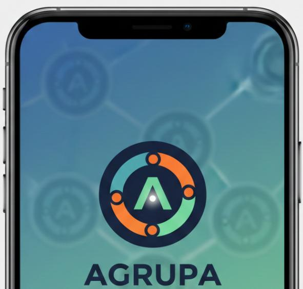

# Documentos do Projeto TAT
## Disciplina de Tópicos Avançados em Tecnologias

## Autores
### Professor da Disciplina e coordenador do projeto
#### Douglas Cunha - douglas!fema.edu.br

## Alunos
| Nome                | Contato                              |
| ------------------- | ------------------------------------ |
| YANN                | yann_pg!hotmail.com                  |
| Clara Joaquim       | clarajpmarques!gmail.com             |
| Gabriela Cunha      | gabiviana.cunha!gmail.com            |
| Sthefany Souza      | sthefany.souza1006!gmail.com         |
| Vitoria Alvim       | vitoria.nardotto!gmail.com           | 
| Kaique Souza        | kaiquesouza1910!gmail.com            |

# Descrição
No mundo dinâmico de hoje, formar grupos de estudo, equipes de projeto ou comunidades com propósitos específicos pode ser um desafio. Conhecer a fundo as habilidades, interesses e personalidades de cada um para criar a combinação perfeita demanda tempo e um olhar apurado.

O objetivo principal desta APP é facilitar o trabalho de um tutor ou professor, para criar grupos com pessoas / alunos para alguma atividade em grupo. 
A APP deve disponibilizar uma interface simplificada e ágil de calcular a quantidade de pessoas pela quantidade de grupos, auxiliando na montagem dos grupos. 

1. A APP deve ser estar disponível na WEB e controlada por um tutor ou professor, via celular, tablet ou computador.
2. Ela irá oferecer duas interfaces distintas (tutor ou professor) para criar os grupos e (usuários) que integram-se aos grupos. 
3. A interface do tutor / professor deve criar a quantidade de grupos com seus respectivos nomes e gerar o QRCode.
4. A interface das pessoas / alunos deve permitir que o mesmo selecione um grupo para participar.
5. Ao final o tutor / professor deve exportar os grupos com as pessoas / alunos num PDF.

# Proposta do Projeto Grupos X Pessoas
{ width="700" heigh="500" align=left }

# Venda
Chega de perder tempo com planilhas e suposições! Com o Agrupa, você, tutor ou líder, tem o poder de otimizar a formação de seus grupos como nunca antes. 

Principais Recursos:
1. Gestão Intuitiva: Acompanhe o progresso dos grupos, faça ajustes e comunique-se de forma eficiente.
2. Ambiente Colaborativo: Incentiva a troca de conhecimentos e fortalece os laços entre os participantes.

Seja para a sala de aula, um projeto corporativo, um evento ou qualquer iniciativa que dependa da formação eficaz de equipes.
O Agrupa é a ferramenta que transforma a complexidade em simplicidade, garantindo resultados superiores.
     # Baixe agora o Agrupa e leve a formação dos seus grupos para um novo nível!
          ## “Agrupa: Juntos, o impossível vira resultado.”

## Frontend
Para que o nome Agrupa faça sentido na experiência do usuário, o app pode ter termos internos personalizados:

1. "Agrupar": O botão principal para iniciar a formação de um novo time.
2. "Células": Em vez de apenas "grupos", você pode chamar os subgrupos de células (mantendo a ideia de algo vivo e orgânico).
3. "Radar Agrupa": Uma funcionalidade onde o tutor visualiza a afinidade entre as pessoas antes de uni-las.

Para o design do app, o contexto do nome sugere elementos de união. Imagine o seguinte:
     O Logotipo: A letra "A" pode ser estilizada como dois braços se encontrando ou como uma seta para cima (crescimento), com um ponto central representando o tutor.
          Paleta de Cores: * Azul e Verde: Transmitem confiança, crescimento e harmonia.
          Laranja e Roxo: Transmitem energia, criatividade e modernidade (ideal se for para o público jovem/universitário).
{ width="300" heigh="500" align=left }

## Regras para Backend
No momento de Criar o Grupo:
1. Gerar os grupos usuarios cuja descrição se entre (A - Z), máximo de 30 grupos.
2. De acordo com a quantidade de usuários por grupo o mentor pode alterar a quantidade de grupos
3. Criar os registro no grupos_usuarios de acordo com a quantidade por grupo.

Cálculo da quantidade de pessoas por grupo 
Hipótese 1
43 alunos / 6 grupos
     43 / 6 = 7,16666  isto é 6 grupos com 7 usuáros e o ultimo grupo com 8 usuáros
26 alunos / 4 grupos
     26 / 4 = 6,5   isto é 4 grupos com 6 usuários e 2 grupos com 7 usuários

## Instalação
Informações sobre a abertura e instalação de ferramentas.

## Execução
Informações sobre a execução da APP.

## Automação
Informações sobre RPA 

## License
A GNU GPL v2 (Licença Pública Geral GNU versão 2) é uma das licenças de software livre mais usadas, um tipo de licença "copyleft forte" criada pela Free Software Foundation, que permite usar, modificar e distribuir software livremente, mas exige que qualquer trabalho derivado ou modificado também seja distribuído sob os mesmos termos da GPL v2, garantindo que o código permaneça aberto e livre, com regras sobre código-fonte e distribuição binária, protegendo as liberdades do usuário. 
Principais Características:
1. Copyleft Forte: Se você usa código GPL v2 em seu projeto, todo o seu projeto deve ser licenciado sob a GPL v2.
2. Liberdade: Garante aos usuários a liberdade de executar, estudar, modificar e redistribuir o software.
3. Código-Fonte: Exige que o código-fonte seja disponibilizado junto com o software (ou uma oferta para fornecê-lo).
4. Sem Garantia: O software é fornecido "como está", sem garantias de mercadoria ou adequação a um propósito específico.
5. Compatibilidade: A versão 2 da GPL (GPLv2) é a base, mas pode ser combinada com outras licenças, como a LGPL (Lesser General Public License), para bibliotecas. 

Para que Serve: É usada para proteger o software de se tornar proprietário, promovendo o compartilhamento de conhecimento e colaboração, sendo a licença de muitos projetos importantes de código aberto. 

Em Resumo: A GPLv2 garante que a essência do software livre (liberdade e código aberto) seja mantida em todas as versões e trabalhos derivados. 
